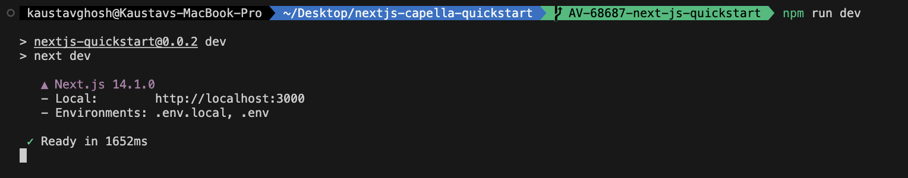

# Quickstart in Couchbase with Next.js

#### Build a REST API with Next.js and Couchbase

Often, the first step developers take after creating their database is to create a REST API capable of performing Create, Read, Update, and Delete (CRUD) operations for that database. This repository is designed to teach you and provide you with a starter project (in Next.js) to generate such a REST API. Once you have installed the travel-sample bucket in your database, you can run this application, which is a REST API with Swagger documentation, to learn:

1. How to create, read, update, and delete documents using [Key-value operations](https://docs.couchbase.com/nodejs-sdk/current/howtos/kv-operations.html) (KV operations). Key-value operations are unique to Couchbase and provide super-fast (think microseconds) queries.
2. How to write simple parameterized [SQL++ queries](https://docs.couchbase.com/nodejs-sdk/current/howtos/n1ql-queries-with-sdk.html) using the built-in travel-sample bucket.

You can find the full documentation for the tutorial on the Couchbase Developer Portal.

If you are looking for a quick start using Node.js, you can find it in this repository.

## Prerequisites

To run this prebuilt project, you will need:

- [Couchbase Capella](https://www.couchbase.com/products/capella/) cluster with [travel-sample](https://docs.couchbase.com/nodejs-sdk/current/ref/travel-app-data-model.html) bucket loaded.
  - To run this tutorial using a self-managed Couchbase cluster, please refer to the [appendix](#running-self-managed-couchbase-cluster).
- [LTS Node.js Version](https://nodejs.org/en/download) installed on local machine.
- Basic knowledge of [JavaScript](https://developer.mozilla.org/en-US/docs/Learn/Getting_started_with_the_web/JavaScript_basics), [TypeScript](https://www.typescriptlang.org/) and [Next.js](https://nextjs.org/learn).
- Loading Travel Sample Bucket
  If travel-sample is not loaded in your Capella cluster, you can load it by following the instructions for your Capella Cluster:
  - [Load travel-sample bucket in Couchbase Capella](https://docs.couchbase.com/cloud/clusters/data-service/import-data-documents.html#import-sample-data)

## Similar Quickstart Repos

If you are looking for a quickstart using Node.js, you can find it in this [repo](https://github.com/couchbase-examples/nodejs-quickstart.git)

If you are looking for a quickstart using TypeScript, you can find it in this [repo](https://github.com/couchbase-examples/typescript-quickstart.git)

If you are looking for a quickstart using Ottoman.js, you can find it in this [repo](https://github.com/couchbase-examples/ottomanjs-quickstart)

## App Setup

We will walk through the different steps required to get the application running.

### Cloning Repo

```shell
git clone https://github.com/couchbase-examples/nextjs-capella-quickstart.git
```

## Install Dependencies

Any dependencies will be installed by running the npm install command, which installs any dependencies required for the project.

```sh
npm install
```

### Setup Database Configuration

To learn more about connecting to your Capella cluster, please follow the [instructions](https://docs.couchbase.com/cloud/get-started/connect.html).

Specifically, you need to do the following:

- Create the [database credentials](https://docs.couchbase.com/cloud/clusters/manage-database-users.html) to access the travel-sample bucket (Read and Write) used in the application.
- [Allow access](https://docs.couchbase.com/cloud/clusters/allow-ip-address.html) to the Cluster from the IP on which the application is running.

All configuration for communication with the database is read from the environment variables. We have provided a convenience feature in this quickstart to read the environment variables from a local file, `dev.env.example`.

Create a copy of `dev.env.example` file and rename it to `dev.env` and add the values for the Couchbase connection.

```sh
DB_CONN_STR=<connection_string>
DB_USERNAME=<user_with_read_write_permission_to_travel-sample_bucket>
DB_PASSWORD=<password_for_user>
DB_BUCKET_NAME=travel-sample
```

> Note: The connection string expects the `couchbases://` or `couchbase://` part.

## Running The Application

### Directly on machine

At this point, we have installed the dependencies, loaded the travel-sample data and configured the application with the credentials. The application is now ready and you can run it.

The application will run on a port specified by Next.js. You can find the port in the terminal after running the application. You will find the [Swagger documentation](#swagger-documentation) at [http://localhost:3000/api-doc](http://localhost:3000/api-doc) of the API if you go to the URL in your browser.

```sh
npm run dev
```

### Using Docker

- Build the Docker image

```sh
docker build -t couchbase-nextjs-quickstart .
```

- Run the Docker image

```sh
docker run -p 3000:3000 nextjs-capella-quickstart -e DB_CONN_STR=<connection_string> -e DB_USERNAME=<user_with_read_write_permission_to_travel-sample_bucket> -e DB_PASSWORD=<password_for_user>
```

> Note: The `dev.env.example` file in the root folder has the connection information to connect to your Capella cluster. Create a copy of `dev.env.example` file and rename it to `dev.env` and add the values for the Couchbase connection.

### Verifying the Application

Once the application starts, you can see the details of the application on the terminal.



The application will run on the port specified by Nextjs on your local machine (eg: http://localhost:3000). You will find the interactive Swagger documentation of the API if you go to the [URL](http://localhost:3000/api-doc) in your browser. Swagger documentation is used in this demo to showcase the different API endpoints and how they can be invoked. More details on the Swagger documentation can be found in the [appendix](#swagger-documentation).


## Running The Tests

Create a copy of `test.env.example` file and rename it to `test.env` and add the values for the Couchbase connection.

```sh
DB_CONN_STR=<connection_string>
DB_USERNAME=<user_with_read_write_permission_to_travel-sample_bucket>
DB_PASSWORD=<password_for_user>
DB_BUCKET_NAME=travel-sample
```


To run the integration tests, use the following commands:

```sh
npm run test
```

## Appendix

### Data Model

For this quickstart, we use three collections, `airport`, `airline` and `routes` that contain sample airports, airlines and airline routes respectively. The routes collection connects the airports and airlines as seen in the figure below. We use these connections in the quickstart to generate airports that are directly connected and airlines connecting to a destination airport. Note that these are just examples to highlight how you can use SQL++ queries to join the collections.


### Extending API by Adding New Entity

If you would like to add another entity to the APIs, these are the steps to follow:

- **Create a new model**: Create a new model for the entity in the `app/models` folder. This model should contain the schema for the entity.

- **Create the new route**: In Next.js 14, you can create a new route by creating a new file in the `app/api` folder. This file should contain the logic for the new entity's CRUD operations. The file path resembles the endpoint path.
  Create a new file in the `app/api` folder with the name of the entity. For example, if you are adding a new entity called `car`, you would create a file called `route.ts` in the `api/v1/car/route.ts` folder. This file should contain the logic for the new entity's CRUD operations.

- **Add the integration tests**: Add integration tests for the new entity in the same folder as the entity's route file. This ensures that the new entity's CRUD operations are tested. The test file should be named `route.test.ts`.

Following these steps ensures a systematic and organized approach to expanding the API functionality with a new entity.

### Running Self-Managed Couchbase Cluster

If you are running this quickstart with a self-managed Couchbase cluster, you need to [load](https://docs.couchbase.com/server/current/manage/manage-settings/install-sample-buckets.html) the travel-sample data bucket in your cluster and generate the credentials for the bucket by [creating a user](https://docs.couchbase.com/server/current/manage/manage-security/manage-users-and-roles.html#add-a-user).

You need to update the connection string and the credentials in the `dev.env` file in the root folder.

> Note: Couchbase Server must be installed and running prior to running this app.

### Swagger Documentation

Swagger documentation provides a clear view of the API including endpoints, HTTP methods, request parameters, and response objects.

Click on an individual endpoint to expand it and see detailed information. This includes the endpoint's description, possible response status codes, and the request parameters it accepts.

#### Trying Out the API

You can try out an API by clicking on the "Try it out" button next to the endpoints.

- Parameters: If an endpoint requires parameters, Swagger UI provides input boxes for you to fill in. This could include path parameters, query strings, headers, or the body of a POST/PUT request.

- Execution: Once you've inputted all the necessary parameters, you can click the "Execute" button to make a live API call. Swagger UI will send the request to the API and display the response directly in the documentation. This includes the response code, response headers, and response body.

#### Models

Swagger documents the structure of request and response bodies using models. These models define the expected data structure using JSON schema and are extremely helpful in understanding what data to send and expect.
